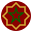

# Moroccan Dirham Coin (MADC) — Official Assets

## About MADC
**Moroccan Dirham Coin (MADC)** is the first serious Moroccan stablecoin pegged to the Moroccan Dirham (MAD) and built on the Ethereum blockchain (ERC‑20 standard).  
Our mission is to create a transparent, secure, and inclusive digital currency that bridges traditional finance and blockchain innovation.

## Token Information
- **Token Name:** Moroccan Dirham Coin
- **Symbol:** MADC
- **Blockchain:** Ethereum
- **Standard:** ERC‑20
- **Total Supply:** 100,000,000 MADC
- **Contract Address:** `0x...` *(Replace with official address)*

## Official Links
- 🌐 Website: [https://madc.io](https://madc.io)
- 📄 Whitepaper: [Download Whitepaper (PDF)](MADC-Whitepaper.pdf)
- 💬 Telegram: [https://t.me/madc_officiel](https://t.me/madc_officiel)
- 🐦 Twitter (X): [https://x.com/MADCOfficiel](https://x.com/MADCOfficiel)
- 💼 LinkedIn: [https://www.linkedin.com/company/madcoin/](https://www.linkedin.com/company/madcoin/)

## Files in this Repository
- **madc_logo_32x32.svg** → Official 32x32 SVG logo for Etherscan, wallets, and exchanges.
- **MADC-Whitepaper.pdf** → The official whitepaper outlining the vision, tokenomics, and roadmap of MADC.

## Logo Usage
The official MADC logo is provided here in SVG format for integration in wallets, exchanges, and block explorers like Etherscan.

**Format:** 32x32 pixels SVG  
**Download:** [madc_logo_32x32.svg](madc_logo_32x32.svg)

---
**Disclaimer:** Cryptocurrencies are subject to market risks. Do your own research before investing.
